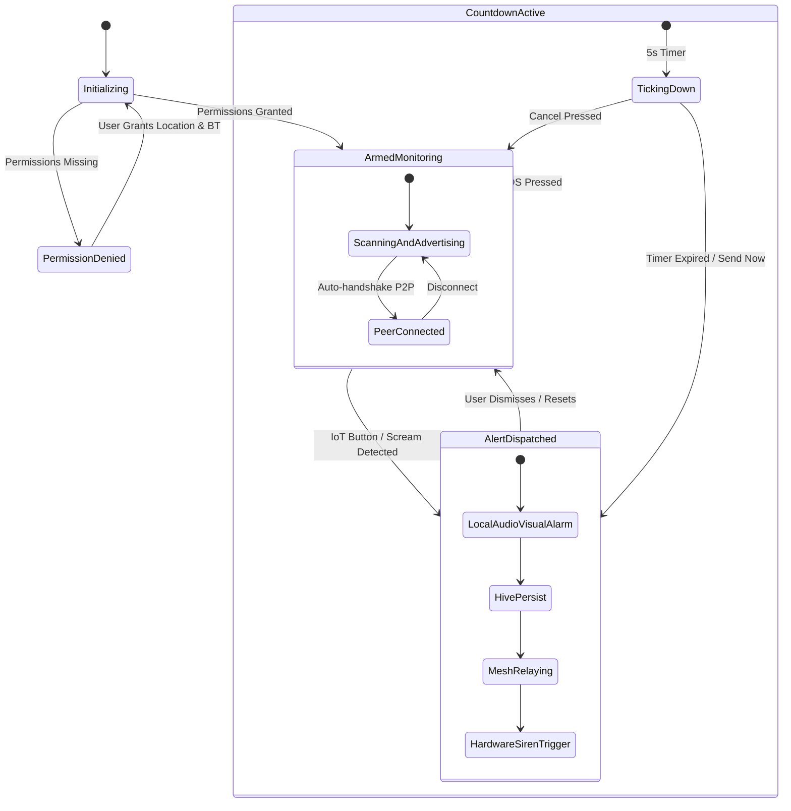
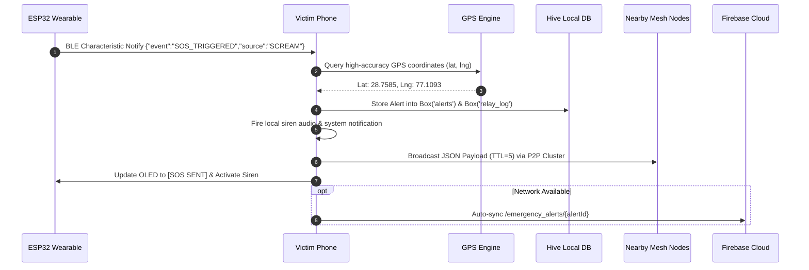
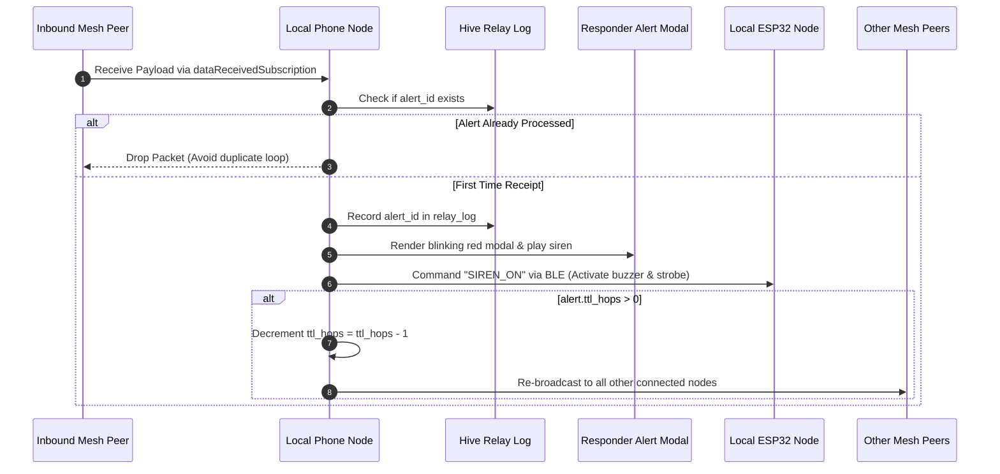

# 🔄 Application & State Machine Flow
## Raksha: Offline Peer-to-Peer Emergency Mesh Network & IoT Safety System

---

## 1. High-Level System State Machine



---

## 2. Emergency Trigger Sequences

### 2.1 Hardware Sensor Initiated SOS (Button or Scream)


### 2.2 Peer Inbound Alert & Multi-Hop Relay Sequence


---

## 3. P2P Mesh Session States
In accordance with `flutter_nearby_connections`, each discovered peer transitions through the following lifecycle states:

```
[ NOT CONNECTED ] ──(Tap Connect)──> [ CONNECTING ]
        ▲                                    │
        │                               (Handshake OK)
        │                                    ▼
 (Disconnect) <─────────────────────── [ CONNECTED ]
                                             │
                                     (Data Transmission)
                                             ▼
                                     [ RELAYING DATA ]
```

- **Not Connected (`0`)**: Node is visible in radio range.
- **Connecting (`1`)**: Symmetric cryptographic handshake in progress.
- **Connected (`2`)**: Full-duplex byte stream socket established for binary/text payloads.
