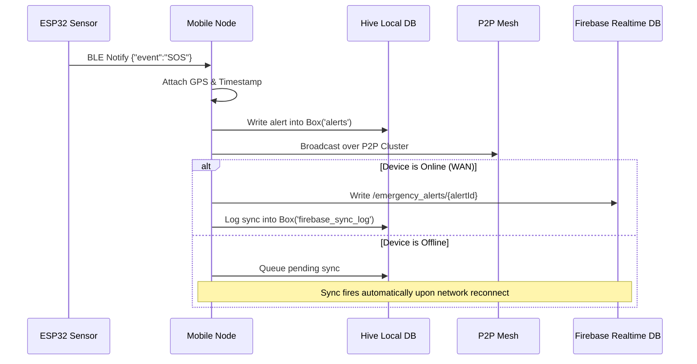

# ⚙️ Technical Requirements Document (TRD)
## Raksha: Offline Peer-to-Peer Emergency Mesh Network & IoT Safety System

---

## 1. Technical Stack Specification

```
┌────────────────────────────────────────────────────────────────────────┐
│                        RAKSHA TECH STACK LAYERS                        │
├──────────────────────┬─────────────────────────────────────────────────┤
│ Layer                │ Technologies & Frameworks                       │
├──────────────────────┼─────────────────────────────────────────────────┤
│ Mobile Client        │ Flutter 3.x, Dart 3.x, Material 3 Design        │
│ P2P Mesh Protocol    │ flutter_nearby_connections (Wi-Fi Direct + BLE) │
│ Embedded Firmware    │ C++ / Arduino IDE, Espressif ESP32 Core v2.x   │
│ IoT Communications   │ BLE GATT Server (NUS Profile), UART 115200 baud │
│ Offline Persistence  │ Hive NoSQL (TypeAdapters, binary key-value)    │
│ Cloud Infrastructure │ Firebase Realtime Database (REST/WebSocket SDK) │
│ Location Engine      │ Geolocator (WGS84 GPS, Fused Location Provider) │
│ Audio & Strobe Core  │ Audioplayers 6.x, Android NotificationManager   │
│ Target Platforms     │ Android 8.0+ (API 26–34+), Cross-platform Ready │
└──────────────────────┴─────────────────────────────────────────────────┘
```

---

## 2. P2P Mesh Network Architecture & Clustering

### 2.1 Topology & Strategy
The mobile layer utilizes **Google Nearby Connections API** with the **P2P_CLUSTER** discovery and connection strategy:
- **Radio Layers**: Dual-band Wi-Fi Direct ($2.4\text{ GHz} / 5\text{ GHz}$) paired with Bluetooth Low Energy (BLE 4.2 / 5.0).
- **Service ID**: `mp-connection`
- **Session Types**: Autonomous discovery and advertising active concurrently in duplex mode.

```
       [ Victim Phone Node ]
             /       \
            /         \
  [ Relay Node B ]  [ Relay Node C ]
          |                 |
  [ Relay Node D ]  [ Responder Node E ]
```

### 2.2 Multi-Hop Packet Relay Algorithm
1. When a node originates an emergency distress packet, it assigns `ttl_hops = 5` and generates a UUIDv4-based `alert_id`.
2. Upon packet receipt, a receiver node checks its local Hive database `relay_log`:
   $$\text{Exists}(alert\_id) \implies \text{Drop Packet (Loop Prevention)}$$
3. If new:
   - Persist into `relay_log` and `alerts` boxes.
   - Fire local audio siren and status-bar notification.
   - Trigger ESP32 IoT hardware siren via BLE.
   - Decrement TTL:
     $$ttl_{new} = ttl_{old} - 1$$
   - If $ttl_{new} > 0$, broadcast to all connected peer nodes except the sender:
     $$\forall d \in \text{ConnectedDevices} \setminus \{\text{senderId}\}, \quad \text{Send}(d, \text{Payload})$$

---

## 3. IoT Wearable Firmware Architecture

### 3.1 ESP32 Microcontroller Specifications
- **MCU**: Tensilica Xtensa Dual-Core 32-bit LX6 @ $240\text{ MHz}$.
- **SRAM**: $520\text{ KB}$, Flash: $4\text{ MB}$.
- **Power Envelope**: $80\text{ mA}$ active monitoring; $190\text{ mA}$ during BLE transmit & piezo siren bursts.

### 3.2 BLE GATT Profile Specification
- **Advertised Device Name**: `Raksha-IoT-SOS`
- **Primary Service UUID**: `4fafc201-1fb5-459e-8fcc-c5c9c331914b`
- **Alert Characteristic (Notify / Read)**:
  - UUID: `beb5483e-36e1-4688-b7f5-ea07361b26a8`
  - Properties: `PROPERTY_READ | PROPERTY_NOTIFY`
  - Descriptor: Client Characteristic Configuration Descriptor (`0x2902`)
- **Command Characteristic (Write)**:
  - UUID: `beb5483f-36e1-4688-b7f5-ea07361b26a8`
  - Properties: `PROPERTY_WRITE | PROPERTY_WRITE_NR`

### 3.3 Acoustic Scream Detection Digital Filter
To prevent false alarms from ambient background noise:
1. Baseline calibration in `setup()` averages 10 quiet samples:
   $$\text{Baseline} = \text{round}\left(\frac{1}{10}\sum_{i=1}^{10} \text{Sample}_i\right)$$
2. When a sound pulse arrives ($S \neq \text{Baseline}$), sample 15 times at $6\text{ ms}$ intervals.
3. If $\ge 6$ out of 15 readings register sustained high intensity, classify as valid acoustic distress and trigger the alarm.
4. Mute acoustic sensor for $2500\text{ ms}$ post-reset to stabilize the internal comparator.

---

## 4. Data Security & Integrity

### 4.1 Packet Schema Specification
```json
{
  "alert_id": "ALERT_B3A19C02",
  "sender_id": "Android_Node_84F1",
  "alert_type": "SECURITY_THREAT",
  "severity": "RED_CRITICAL",
  "location": {
    "lat": 28.758521,
    "lng": 77.109314
  },
  "description": "🚨 Physical Wearable SOS Button Pressed",
  "timestamp": "2026-09-24 14:30:15",
  "ttl_hops": 4
}
```

### 4.2 Tamper Prevention & Replay Protection
- `alert_id` is cryptographically unique (UUIDv4 prefix).
- Strict timestamp validation discards packets with drift $> 24\text{ hours}$.
- Hive storage enforces key immutability; existing alert entries cannot be overwritten with degraded payloads.

---

## 5. Storage & Synchronization Engine


