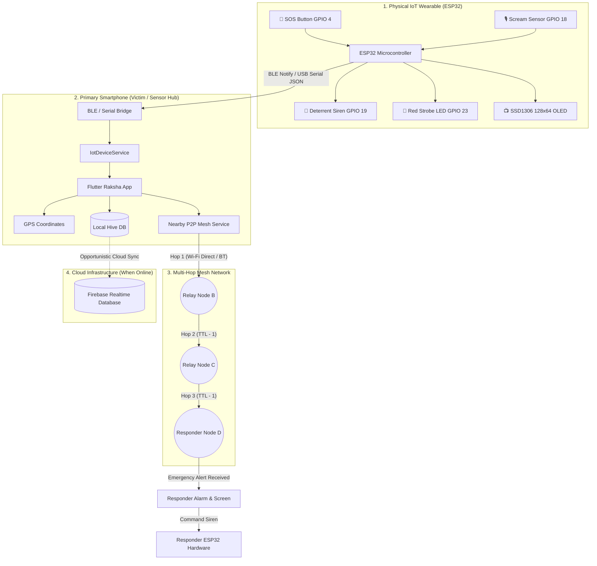

# 🛡️ Raksha: Offline Emergency Mesh Network & IoT Safety System

[](https://flutter.dev)
[](https://dart.dev)
[](https://www.espressif.com/)
[](https://www.bluetooth.com/)
[](https://docs.hivedb.dev/)
[](https://firebase.google.com/)

An autonomous, decentralized emergency communication and personal safety ecosystem designed for **disaster relief, network dead-zones, remote campuses, and high-threat environments**.

When cellular towers, Wi-Fi routers, and mobile data networks collapse or are intentionally jammed, **Raksha** forms an ad-hoc, multi-hop peer-to-peer (P2P) mesh network across nearby smartphones and pairs seamlessly with physical **ESP32 IoT wearable safety hardware** to relay life-saving distress signals.

---

## 🏗️ System Architecture



---

## 📁 Project Folder Architecture

The repository is structured into modular layers: architectural engineering blueprints (`docs/`), embedded IoT firmware (`iot/`), and a clean, layered Flutter application (`lib/`):

```
Raksha-Emergency-Mesh/
│
├── 📚 docs/                                  # Engineering & Architectural Blueprints
│   ├── PRD.md                               # Product Requirements Document (Scope, Personas, SLAs)
│   ├── TRD.md                               # Technical Requirements Document (Stack, Security, Latencies)
│   ├── UI_UX_DESIGN.md                      # Mobile UI/UX Design System, Color Hierarchy & Wireframes
│   ├── APP_FLOW.md                          # Application State Machine & Multi-Hop Relay Sequences
│   ├── MESH_PROTOCOL.md                     # P2P Cluster Protocol, Packet Schema & TTL Relay Math
│   ├── IOT_HARDWARE_SPEC.md                 # ESP32 Circuitry, BLE Specs, Acoustic DSP & Pinouts
│   ├── Raksha_Emergency_Mesh_100_QnA.pdf    # 100-Question Viva & Presentation Defense Guide
│   └── generate_pdf.py                      # ReportLab documentation generator utility
│
├── ⚡ iot/                                   # Embedded ESP32 Hardware Firmware
│   ├── firmware/
│   │   └── raksha_esp32_firmware.ino        # Primary production C++ sketch (BLE, Sensors, OLED, Siren)
│   └── README.md                            # Hardware schematics, wiring pinout & flashing guide
│
├── 💻 lib/                                   # Clean Modular Flutter Application
│   ├── main.dart                            # Application entrypoint & dependency initialization
│   │
│   ├── core/                                # Core Application Infrastructure
│   │   ├── constants/
│   │   │   └── app_constants.dart           # BLE UUIDs, Alert Types, Severities, Hive keys
│   │   ├── theme/
│   │   │   └── app_theme.dart               # Tactical Emergency Dark & Alert Red themes
│   │   └── utils/
│   │       └── location_helper.dart         # Geolocator wrapper & GPS coordinate parsing
│   │
│   ├── data/                                # Data Layer (Models & Local Persistence)
│   │   ├── models/
│   │   │   ├── emergency_alert.dart         # EmergencyAlert schema (Lat/Lng, TTL, Hash)
│   │   │   └── chat_message.dart            # Mesh chat message DTO
│   │   └── local/
│   │       └── hive_storage_service.dart    # Hive storage boxes (alerts, relay_log, chat)
│   │
│   ├── services/                            # Business & Background Services
│   │   ├── mesh_network_service.dart        # Nearby Connections P2P clustering & relay
│   │   ├── iot_device_service.dart          # ESP32 BLE / Serial bridge & sensor telemetry
│   │   ├── firebase_sync_service.dart       # Opportunistic offline-to-cloud sync
│   │   └── notification_service.dart        # System heads-up notifications & siren sound
│   │
│   └── views/                               # Presentation Layer
│       ├── dashboard/
│       │   └── home_dashboard_screen.dart   # Main Emergency Mesh monitoring screen
│       ├── widgets/
│       │   ├── iot_hardware_card.dart       # ESP32 live status, sensor chips & tests
│       │   ├── mesh_devices_section.dart    # Discovered & connected mesh peer nodes
│       │   ├── mesh_messenger_box.dart      # Offline P2P text messaging component
│       │   └── saved_alerts_list.dart       # Offline incident history cards
│       └── dialogs/
│           ├── sos_countdown_dialog.dart    # 5-second cancellable SOS trigger modal
│           ├── responder_alert_dialog.dart  # Critical inbound alert modal with siren
│           └── iot_logs_dialog.dart         # Real-time Serial/BLE packet inspector
│
├── 📱 android/                              # Native Android build engine & Gradle manifests
├── 🍏 ios/                                  # Native iOS runner workspace & permissions
├── 🧪 test/                                 # Unit and widget test suite
├── 📦 pubspec.yaml                          # Dart dependencies & package metadata
├── 🚀 app-release.apk                       # Production signed Android release binary (~53.8 MB)
└── 📖 README.md                             # Master project architecture & usage guide
```

### Architectural Blueprints & Modules

| Blueprint / Module | Link | Description |
| :--- | :--- | :--- |
| **Product Requirements** | [PRD.md](file:///c:/Users/Harshit/StudioProjects/idea/docs/PRD.md) | Vision, user personas, functional requirements, and performance SLAs. |
| **Technical Specifications**| [TRD.md](file:///c:/Users/Harshit/StudioProjects/idea/docs/TRD.md) | Technical stack, zero-infrastructure networking, security, and storage architecture. |
| **UI/UX Design System** | [UI_UX_DESIGN.md](file:///c:/Users/Harshit/StudioProjects/idea/docs/UI_UX_DESIGN.md) | High-contrast emergency HUD, design tokens, color hierarchy, and wireframes. |
| **Application Flow** | [APP_FLOW.md](file:///c:/Users/Harshit/StudioProjects/idea/docs/APP_FLOW.md) | State machines for node discovery, emergency sequences, and multi-hop relay. |
| **P2P Mesh Protocol** | [MESH_PROTOCOL.md](file:///c:/Users/Harshit/StudioProjects/idea/docs/MESH_PROTOCOL.md) | Ad-hoc dynamic clustering, wire packet schemas, TTL decay, and de-duplication math. |
| **IoT Hardware Spec** | [IOT_HARDWARE_SPEC.md](file:///c:/Users/Harshit/StudioProjects/idea/docs/IOT_HARDWARE_SPEC.md) | ESP32 schematic, acoustic scream detection DSP, BLE GATT characteristics, and OLED layouts. |


---

## 🌟 Core Features

### 1. Zero-Internet P2P Mesh Communication
- Powered by `flutter_nearby_connections` utilizing the **P2P_CLUSTER** star/mesh topology.
- Devices continuously discover and advertise to nearby peers over Bluetooth and Wi-Fi Direct.
- Operates 100% offline without cellular reception, SIM cards, or external routers.

### 2. Multi-Hop Distress Relay (TTL Decrementing)
- Emergency packets include a configurable **Time-To-Live (TTL)** counter (default: 5 hops).
- When a phone receives an alert, it verifies uniqueness via a local de-duplication cache (`relay_log` in Hive), logs the incident, sounds its local alarm, and forwards the payload to all other connected peers.

### 3. ESP32 Physical Wearable Integration
- **Manual Push Button (GPIO 4)**: Debounced instant SOS trigger (tap to alert, tap again to cancel).
- **Acoustic Scream Detection (GPIO 18)**: High-sensitivity microphone sensor detecting acoustic distress spikes (screams, shouts, glass breaks).
- **Local Audio-Visual Deterrent**: 2-tone high-pitch siren buzzer (GPIO 19) synchronized with flashing emergency red strobe LED (GPIO 23).
- **Real-Time OLED Screen (I2C SSD1306)**: Displays live state (`[SAFE]`, `[SOS SENT]`, `[REMOTE MESH SOS]`).
- **Bi-Directional Phone Link**:
  - Hardware to Phone: Triggers automated GPS injection and mesh broadcast.
  - Mesh to Hardware: Peer distress alerts activate the physical wearable buzzer and strobe.

### 4. Offline-First Storage & Cloud Synchronization
- All messages and emergency events are persisted immediately in fast, encrypted **Hive NoSQL boxes** (`alerts`, `relay_log`, `chat_messages`).
- When any node in the mesh regains 4G/5G/Wi-Fi access, `FirebaseSyncService` silently batches and uploads offline records to the cloud database for centralized disaster response monitoring.

### 5. Mesh Offline Text Messenger
- Embedded peer-to-peer encrypted text messenger allowing survival communication and responder coordination without external infrastructure.

---

## 🔌 Hardware Pinout & Circuit Wiring

| Component | ESP32 Pin | Mode | Purpose |
| :--- | :--- | :--- | :--- |
| **SOS Push Button** | **GPIO 4** | `INPUT_PULLUP` | Emergency trigger & cancel button |
| **Microphone / Scream Sensor** | **GPIO 18** | `INPUT` | Digital scream/distress sound detector |
| **Deterrent Siren Buzzer** | **GPIO 19** | `OUTPUT` | Oscillating dual-tone audible alarm |
| **Red Emergency Strobe LED** | **GPIO 23** | `OUTPUT` | Flashing visual distress indicator |
| **Green Status LED** | **GPIO 5** | `OUTPUT` | Armed and safe monitoring indicator |
| **SSD1306 OLED (SDA)** | **GPIO 21** | `I2C SDA` | OLED display data line |
| **SSD1306 OLED (SCL)** | **GPIO 22** | `I2C SCL` | OLED display clock line |
| **Power (VCC / GND)** | **3.3V / GND**| Power | Regulated power rails |

---

## 🚀 Getting Started

### Prerequisites
- **Flutter SDK**: v3.12+ installed
- **Android Studio / VS Code**: with Dart & Flutter plugins
- **Arduino IDE**: with `esp32 by Espressif Systems` board package
- **Physical Devices**: Android 8.0+ smartphones (Bluetooth & Location enabled)

---

### Mobile App Installation & Run

1. **Clone & Navigate**:
   ```bash
   git clone https://github.com/your-username/raksha-emergency-mesh.git
   cd raksha-emergency-mesh
   ```

2. **Install Flutter Dependencies**:
   ```bash
   flutter pub get
   ```

3. **Run on Connected Device**:
   ```bash
   flutter run
   ```

4. **Install Pre-built Release APK directly**:
   Transfer `app-release.apk` to any Android device and tap to install.

---

### IoT Hardware Firmware Flashing

1. Open **Arduino IDE**.
2. Open the sketch:
   `Raksha-IoT-Code/Raksha-IoT-Code.ino`
3. Install required libraries from Library Manager:
   - `Adafruit SSD1306`
   - `Adafruit GFX Library`
4. Select Board: **ESP32 Dev Module**
5. Connect your ESP32 via USB and click **Upload**.
6. Open Serial Monitor at **115200 baud** to view real-time telemetry packets.

---

## 🧪 Demonstration & Viva Testing Guide

| Step | Action | Expected Output |
| :--- | :--- | :--- |
| **1. Hardware Button SOS** | Press physical red button on ESP32 (or tap *"Test Button SOS"* in app). | ESP32 sounds siren + flashes red LED + OLED displays `[SOS SENT]`. Phone captures GPS, plays siren, logs alert to Hive, and broadcasts to mesh peers. |
| **2. Scream Detection** | Shout or clap loudly near the microphone (or tap *"Test Scream Sensor"* in app). | ESP32 detects acoustic spike, OLED indicates `SRC: SCREAM DETECTED`, and app sends emergency alert across mesh. |
| **3. Mesh Peer Alarm** | Peer smartphone sends an alert over mesh. | Receiving phone displays red emergency modal, and commands connected ESP32 to activate buzzer and display `[REMOTE MESH SOS]`. |
| **4. Dismissal & Reset** | Tap *"DISMISS"* or *"Silence Hardware"* on mobile screen. | Phone audio stops, ESP32 siren silences, red LED turns off, green LED turns on, and OLED resets to `[SAFE]`. |
| **5. Live Packet Inspection** | Tap the history icon next to battery in the app's IoT card. | Scrollable dialog displays live, timestamped BLE & Serial JSON telemetry packets. |

---

## 📄 License & Attribution

This project is licensed under the **MIT License**. Developed as a comprehensive emergency communication and decentralized disaster resilience platform.
